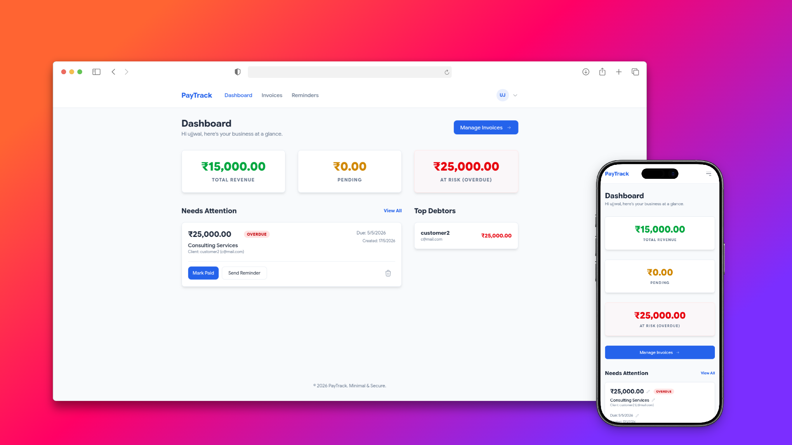

# PayTrack



A high-performance, minimal invoice tracking system built with Preact and Express.

Check the app out at [PayTrack Demo](https://paytrack-demo.onrender.com/)

---

## Getting Started

### Prerequisites
- **Node.js v22+**
- **pnpm**

### Installation & Configuration
1. **Install Dependencies**:
   ```bash
   pnpm install
   ```
2. **Environment Setup**:
   ```bash
   # Backend: Configure RESEND_API_KEY and JWT_SECRET
   cp backend/.env.example backend/.env

   # Frontend: Define API endpoint
   cp frontend/.env.example frontend/.env
   ```
3. **Execution**:
   ```bash
   pnpm dev
   ```

---

## Technical Overview

PayTrack is engineered for low latency and high maintainability using a modern, type-safe stack.

- **Frontend**: **Preact** + **Signals** (Reactivity) + **Tailwind CSS** (Styling).
- **Backend**: **Node.js** + **Express 5** + **TypeScript**.
- **Persistence**: **SQLite** via `better-sqlite3` (Sync performance, zero-config).
- **Email Pipeline**: **Resend** integration for transactional payment notifications.

### Architecture Highlights

The project is structured as a **pnpm monorepo**, ensuring tight coupling between API definitions and UI state. 

- **State Management**: Uses `@preact/signals` for global state (Auth, Invoices, Customers), bypassing the overhead of traditional flux patterns in favor of transparent, fine-grained DOM updates.
- **Session Security**: Implements JWT-based authentication via HttpOnly, Secure cookies.
- **Data Integrity**: Enforces strict ownership validation at the database layer; every query is scoped to the authenticated `user_id`.

For deeper technical implementation details, see the **[Architecture & Design Guide](./docs/explanation/architecture.md)**.

---

## Technical Documentation

- **[Deployment Guide](./docs/tutorials/getting-started.md)**: Standard environment setup and first-run procedures.
- **[Feature Implementation: Reminders](./docs/how-to/send-reminders.md)**: Details on the reminder dispatch pipeline and Resend integration.
- **[API Reference](./docs/reference/api-spec.md)**: OpenAPI-style technical specifications of data models and endpoints.
- **[Architecture Deep Dive](./docs/explanation/architecture.md)**: Rationale behind the choice of Preact Signals, SQLite, and the monorepo structure.

---

## Project Limitations

The current live demo and implementation have several known limitations due to the development environment and service tiers:

- **Email Dispatch**: Due to Resend API restrictions on the free tier, the system can currently only send emails to the developer's verified email address (or the address configured as the verified sender).
- **Ephemeral Persistence**: The live demo utilizes a temporary file-based SQLite database. As a result, data may be periodically reset or cleared depending on the hosting provider's container lifecycle.
- **Concurrent Sessions**: The current SQLite configuration is optimized for single-user or small-team environments and does not currently implement row-level locking for high-concurrency scenarios.

---

## Future Roadmap

We are actively planning the following features to enhance PayTrack's utility for larger scale operations:

- **Automatic Reminders**: Implementation of a background worker (e.g., using BullMQ or Cron) to automatically dispatch reminders based on due dates.
- **Dashboard Alerts**: Real-time browser notifications for overdue invoices and successful payment receipts.
- **Multiple Currency Support**: Ability to manage invoices in various international currencies with automatic exchange rate conversion.
- **Admin Panel**: A high-level administrative interface for managing system-wide settings, user accounts, and global financial reports.
